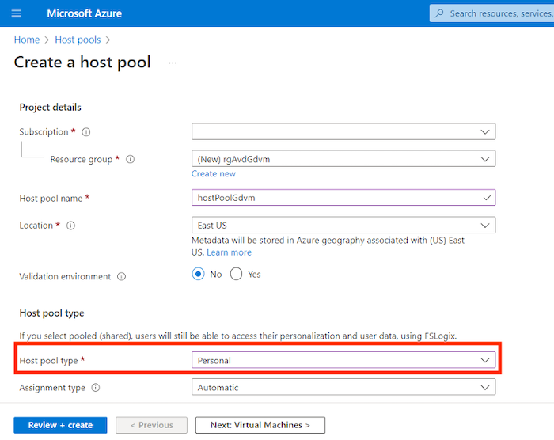
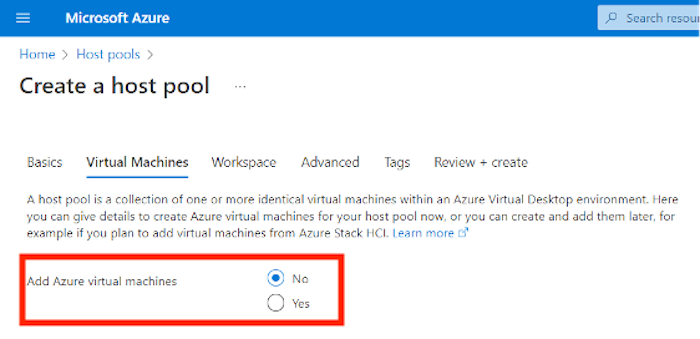
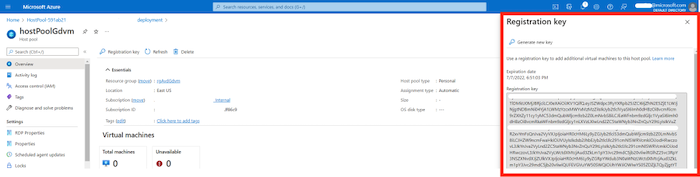
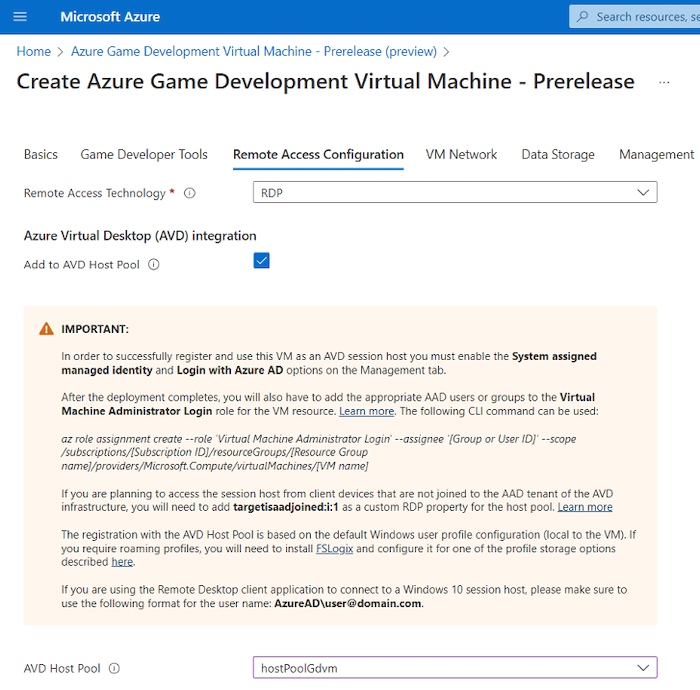
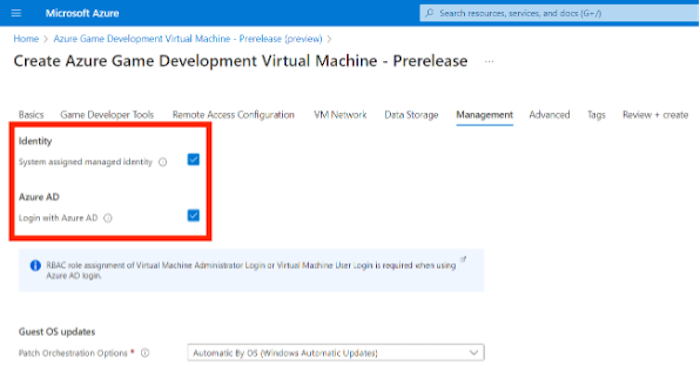
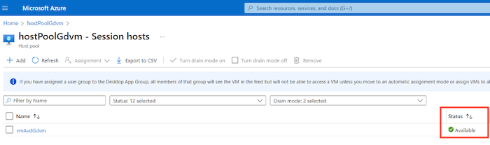
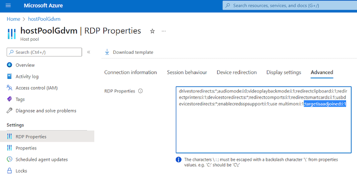
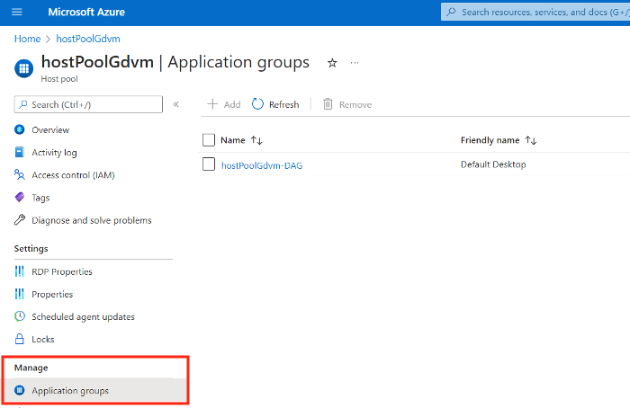
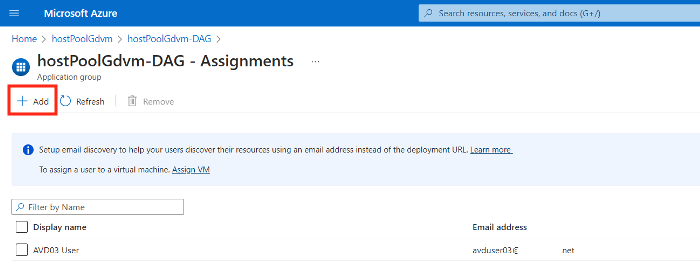

# Integrate with Azure Virtual Desktop (AVD)

[Azure Virtual Desktop (AVD)](https://azure.microsoft.com/services/virtual-desktop/#overview) is a desktop and app virtualization service that runs on the Azure cloud. It enables secure remote work using Windows hosts via a scalable multi-session experience for your end users. It saves costs by using existing eligible Windows licenses. You manage your end-to-end Azure Virtual Desktop deployment alongside other Azure services within the Azure portal, or via PowerShell or CLI.

The Azure Game Development Virtual Machine provisioning supports direct integration with AVD. When this option is selected and the provisioning completes, the virtual machine is auto-registered as a session host within an existing [AVD Host Pool](/azure/virtual-desktop/environment-setup#host-pools) and it becomes available for new remote user sessions.

## Prerequisites

You must have an existing AVD Host Pool that the new Game Development Virtual Machine will auto-register with.

## Azure Virtual Desktop Host Pool

If you do not have an existing host pool, you can create one by following the steps outlined in the [create a host pool tutorial](/azure/virtual-desktop/create-host-pools-azure-marketplace?tabs=azure-portal). Select **Personal** for **Host pool type** when creating the host pool.



At the **Virtual Machines** step, select **No** to **Add Azure virtual machines**, and skip the creation of virtual machines at this stage, since the Game Development Virtual Machine provisioning will auto-register the new VM with the selected Host Pool.



At the **Workspace** step, select **Yes** to **Register a desktop app group**, then select from an existing group, or create a new app group.


Ensure that you have a valid/active **Registration key**. There is no need to copy that key as it is automatically retrieved by the Game Development Virtual Machine provisioning.



## Configuring the Game Development Virtual Machine for AVD integration

1. When creating a new Game Development Virtual Machine, on the **Remote Access Configuration** tab select **RDP** as the **Remote Access Technology**.
2. Select the **Add to AVD Host Pool** checkbox under Azure Virtual Desktop (AVD) integration
3. Use the **AVD Host Pool** drop-down box to select the existing AVD Host Pool to add the VM to.



4. On the Management tab, select both **System assigned managed identity** and **Login with Azure AD**.



5. After the VM is created, assign the AAD users that will be remoting into the VM (now an AVD session host) the Virtual Machine Administrator Login or Virtual Machine User Login role. This can be done via the CLI, or the portal. Note: Make sure to replace the parameters with their correct values when using the following CLI command.

```azurecli-interactive
az role assignment create --role 'Virtual Machine Administrator Login' --assignee 'AAD_USER_ID' --scope /subscriptions/SUBSCRIPTION_ID/resourceGroups/RESOURCE_GROUP/providers/Microsoft.Compute/virtualMachines/VM_NAME
```

6. Navigate to the **Overview** page of the Host Pool resource. The Total machines tile should reflect the addition of the new Game Development Virtual Machine.


7. Navigating to **Session hosts** via the left-hand side command bar will list the VMs currently in the Host Pool. Note that initially the new VM may be showing as _Upgrading_. After a few minutes, the status should change to _Available_.



8. Update the RDP properties of the Host Pool resource to include **targetisaadjoined:i:1**. This is required if the client machine used for remote access to the VM is not registered with the same Azure AD tenant as the VM. Then click on the **Save** button after you add the new property.



9. The final step before connecting to the VM via AVD is to add the user(s) who will be accessing the VM to the Application Group associated with the Host Pool. To do that, select **Application groups** from the left-hand side command bar of the Host Pool resource and click on the desktop application group for the host pool.



On the overview pane of the Application group, select **Assignments (manage)**. Use the **Add** button to search for and add the users(s) to the list. Note that the users appearing in this list should be the same as the identities added to the "Virtual Machine Administrator/User Login" role for the VM.



## Connecting to the VM via AVD

The simplest way to connect to the VM via AVD is to use the Remote Desktop Web Client.

1. Login to the [Remote Desktop Web Client](https://client.wvd.microsoft.com/arm/webclient/index.html) with one of the identities that should have access to the AVD session host VM (see Step 5 and Step 9 in the previous section). The Workspace associated with the Host Pool will appear, with a **SessionDesktop** icon underneath
1. After clicking on the SessionDesktop icon, a prompt appears where access to local (client workstation) resources can be configured. Then click the **Allow** button.
1. At the login prompt, enter the user password and click **Submit**.
1. You should now be connected to the Game Development Virtual Machine AVD session host.
